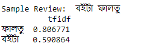

## Polarity Detection of Bengali Book Reviews Using Machine Learning: Project Overview
- Created a tool that can detect the sentiment polarity (either **positive or negative**) of Book reviews written in Bengali Text. 
- Collected `1k` book reviews from different online book shops as well as social media groups. Among these reviews `528` reviews are labelled as positve and `472` reviews are labelled as negative sentiment.
- Use a custom *stopword list* for removing some words that have not much impact on classification.
- Extract `Unigram, Bigram and Trigram` features from the cleaned Text and use the `TF-idf vectorizer` as a feature extraction technique.
- Employed different machine learning classifiers for the classification purpose. The used classifiers are `Logistic Regression, Decision Tree, Multinomial Naive Bayes, Support Vector Machine` and so on.
- Evaluate the performance of the classification for every gram feature. `Accuracy, Precision, Recall, F1-score, ROC curve and Precision-Recall curve` used as evaluation metrics.
- Finally created a `client facing API` using Flask. 

## Project Outline 
- Dataset Preparation
- Dataset Summary 
- Feature Extraction
- Model Evaluation
    - Numerical Measures
    - Graphical Measures
- Model Deployment

## Dataset Preparation
`1.4k` Bengali book reviews are collected from different online book shops and social media groups. **The dataset is available at this repository**. Then the data's are cleaned by removing unneccessary symbols, tokens and numbers from the texts. 

**Dataset Description:** 

All the collected reviews are manually annotated by two native Bengali speaker. The dataset consists of two columns. First column is `Review` column which is filled with the bengali book reviews and second column is the `Sentiment` column which contains corresponding labels of the reviews (`Positive (1) or Negative (0)`).

| Index         | Review        | Sentiment  |
| ------------- |:-------------:| -----:|
| 1      | Review 1      |    1 |
| 2      | Review 2      |    0 |
| 1400   | Review 1400   |    1 |

**Some sample reviews from the dataset:**

## Summary of the dataset

Dataset summary includes various information about the dataset such as total number of words in each class, unique words in each class and length distribution of the reviews.

**Statistics about the dataset:**

**Length Distribution:** The length distribution plot shows that most of the reviews length are between `20 to 50`.

## Feature Extraction 

Tf-idf values of the gram features used for the classification. The calculated features are splitted into `train and test` set for model preparation.

**Tf-idf values for unigram feature for a sample review:**

**Splitted into (80%-20%) ratio:** Total number of unigram feature is `6292`.

## Model Building and Evaluation

The performance of the different machine learning algorithms on numerical measues. The table provides the performance information only for *unigram features*. We obtained best outcome for `Multinomial Naive Bayes Algorithm` which provides correspondingly **`93%` accuracy and F1-score value**.    

**The performance on the graphical measures are:**  In this evaluation `Multinomial Naive Bayes Algorithm` provides outstanding performance.

 

***Thus, our selected ML model is `Multinomial Naive Bayes Classifer`*** 

## Model Deployment  
For the deployment a webpage is created using **Bootstrap** and used Flask Framework. **Heroku** Cloud platfrom is used for the model deployment.

**Here, is the Flask App of the Project:**  [Book Review Classifier App](https://sa-book-review.herokuapp.com/).

## 

## Resources and Packages
**Python Version:** 3.7

**Packages:** Pandas, Numpy, Matplotlib, Seaborn, Scikit Learn, Pickle

**Deployment Framework:** Flask

**Related Publication:** [Sentiment Polarity Detection on Bengali Book Reviews Using Multinomial Naïve Bayes](https://www.researchgate.net/publication/342673109_Sentiment_Polarity_Detection_on_Bengali_Book_Reviews_Using_Multinomial_Naive_Bayes).

## Acknowledgement

This work owes its gratitude to [Omar Sharif](https://www.researchgate.net/profile/Omar_Sharif14) who has equal contribution to develop this project and finally, thanks to [Prof. Dr. Mohammed Moshiul Hoque](https://www.researchgate.net/profile/Moshiul_Hoque) for his valuable guidance in this research.     

